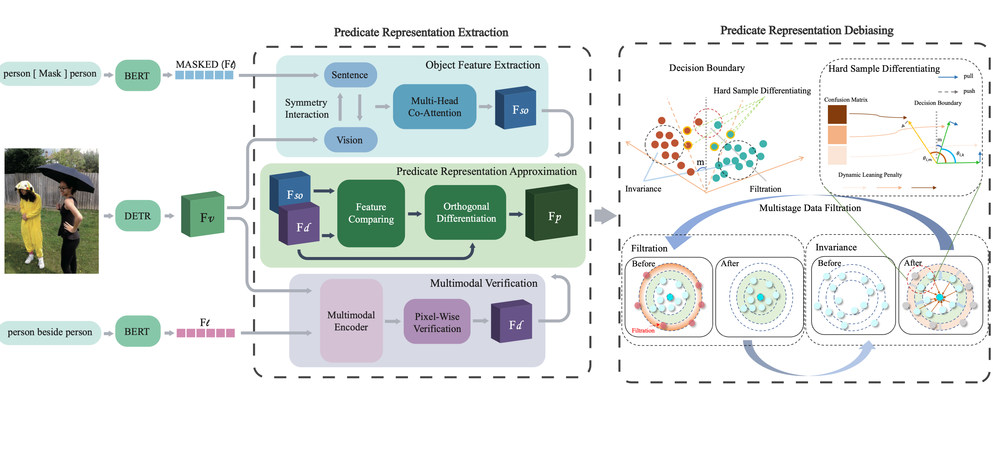
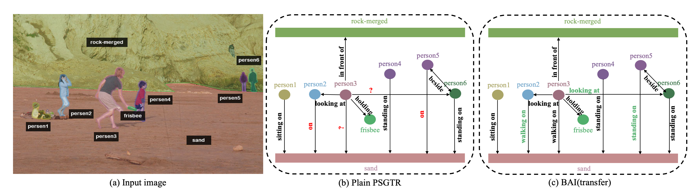

# BAI

## Steps to get started
To setup the environment, we use `conda` to manage our dependencies.

Our developers use `CUDA 10.1` to do experiments.

You can specify the appropriate `cudatoolkit` version to install on your machine in the `environment.yml` file, and then run the following to create the `conda` environment:
```bash
conda env create -f environment.yml
```
You shall manually install the following dependencies.
```bash
# Install mmcv
## CAUTION: The latest versions of mmcv 1.5.3, mmdet 2.25.0 are not well supported, due to bugs in mmdet.
pip install mmcv-full==1.4.3 -f https://download.openmmlab.com/mmcv/dist/cu101/torch1.7.0/index.html

# Install mmdet
pip install openmim
mim install mmdet==2.20.0

# Install coco panopticapi
pip install git+https://github.com/cocodataset/panopticapi.git

# For visualization
conda install -c conda-forge pycocotools
pip install detectron2==0.5 -f \
  https://dl.fbaipublicfiles.com/detectron2/wheels/cu101/torch1.7/index.html

# If you're using wandb for logging
pip install wandb
wandb login

# If you develop and run openpsg directly, install it from source:
pip install -v -e .
# "-v" means verbose, or more output
# "-e" means installing a project in editable mode,
# thus any local modifications made to the code will take effect without reinstallation.
```

To explore and download their original Dataset:

https://psgdataset.org/index.html

Or you can directly download their original dataset using the link they provided: 

https://entuedu-my.sharepoint.com/:f:/g/personal/jingkang001_e_ntu_edu_sg/EgQzvsYo3t9BpxgMZ6VHaEMBDAb7v0UgI8iIAExQUJq62Q?e=fIY3zh 

And some pre-trained models that possibly be used:

https://drive.google.com/drive/folders/1PY0JPCtkOS5Db8-CTFgORvWlOWsYiHfq?usp=sharing


Our codebase accesses the datasets from `./data/` and pre-trained models from `./work_dirs/checkpoints/` by default.

Our checkpoint for PSGTR is available at:

https://drive.google.com/file/d/1P2W2PXdRVuv9o_MUSudY7cY0jC3i1xHa/view?usp=sharing

Users should change the json filename in config/_base_/datasets/psg.py (Line 4-5) to './data/psg/psg.json'.



## Testing
Run the scripts below:
```bash
PYTHONPATH='.':$PYTHONPATH  \
python tools/test.py  \
configs/psgtr/psgtr_r50_psg.py \
work_dirs/PATH_TO_PSGTR_CHECKPOINT \
--eval sgdet
```

